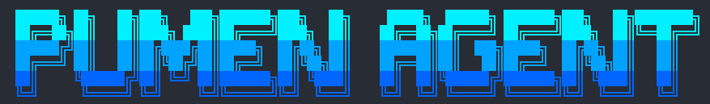

<p align="center">
  
</p>

# Pumen Agent
<p align="center">
  
  
  
  
</p>

**Pumen Agent** is an exclusive smart AI assistant project by Pumen, currently in its early stages of development. The project provides an interactive Command Line Interface (CLI) and supports automating browser tasks using Large Language Models (LLMs).

---

## 🎯 Goals

- Build a powerful, highly responsive AI assistant that integrates directly into your workflow via the terminal.
- Provide an intuitive Terminal UI (TUI) featuring intelligent autocomplete and command suggestions.
- Automate web browser tasks through a reliable AI agent (Browser Automation).
- Offer a flexible, modular architecture that makes it easy to add new AI providers, slash commands, and skills.

## 🚀 Setup

1. **Clone the repository**
   ```bash
   git clone <repository_url>
   cd pumen-agent
   ```

2. **Create a Python virtual environment**
   Ensure you have Python 3.11.5 installed.
   ```bash
   python -m venv venv
   source venv/bin/activate  # On Windows, use: venv\Scripts\activate
   ```

3. **Install dependencies**
   ```bash
   pip install -e .
   ```

4. **Configure environment variables**
   Create a `.env` file in the root directory of the project and set your API keys:
   ```env
   GEMINI_API_KEY=your_gemini_api_key_here
   ```

5. **Start the application**
   Run the Pumen Agent with the following command:
   ```bash
   python main.py
   ```